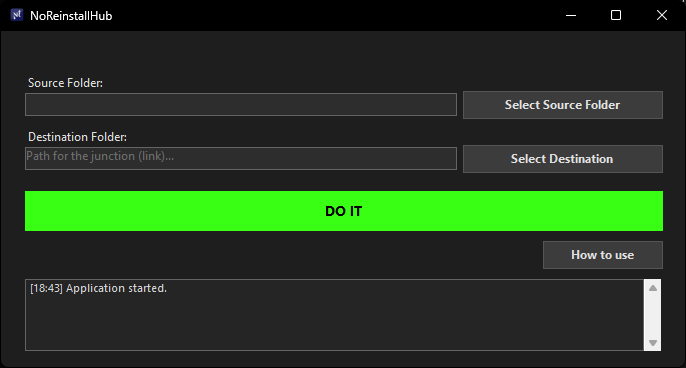

# NoReinstallHub

> **A modern utility to 'trick' Windows by moving heavy folders to other drives without breaking paths.**

---

## 📸 Screenshot

<!-- TODO: Add a screenshot of the application here -->


*NoReinstallHub features a **modern dark UI** with a charcoal background (#1e1e1e) and a vibrant **neon green "DO IT" button** for creating junction points. The interface includes source/destination folder selection, live logging, and admin privilege detection.*

---

## ✨ Key Features

| Feature | Description |
|--------|-------------|
| 🔗 **Junction point creation** | Creates NTFS junction points so Windows and apps see files where they expect them, while data lives on another drive. |
| 🛡️ **Admin privilege detection** | Detects if the app is not running as Administrator and shows a clear warning with a **Restart as Admin** option. |
| 📋 **Live logging system** | A read-only log at the bottom shows timestamped actions (e.g. `[20:34] Source validated`, `[20:35] Success`). |
| 📦 **Zero-footprint (portable)** | No installer required. Run the single `.exe` from any folder—fully portable. |

---

## 🧠 The Logic

NoReinstallHub uses **NTFS Junction Points** (directory hard links). When you create a junction:

- **Source folder** = where the real files actually live (e.g. on an HDD or another drive).
- **Destination folder** = the path that Windows or your games *think* the files are at (e.g. `C:\Program Files\MyGame`).

Windows and applications follow the junction transparently. You can move large game installs or data folders to another drive **without reinstalling** or breaking shortcuts—paths stay the same, only the physical location changes.

---

## 📥 Installation

- **Portable app:** No installation needed. Download the latest release and run `NoReinstallHub.exe`.
- **Requirement:** [.NET 8 Runtime](https://dotnet.microsoft.com/download/dotnet/8.0) (Windows). If you don’t have it, install the **.NET Desktop Runtime 8** for Windows.

**Build from source (optional):**

```bash
git clone <repo-url>
cd WindowsFileEnganer
dotnet publish -c Release -r win-x64 --self-contained false -o publish
```

The executable will be at `publish\NoReinstallHub.exe`.

---

## 🚀 How to Use

1. **Source Folder** — Select the folder that contains the actual data (e.g. on your HDD).
2. **Destination Folder** — Select (or choose the parent of) the path where Windows or your software expects the files. **This folder must not exist yet**, or must be empty; the app will create the junction with that name.
3. **DO IT** — Click the green button. A “ghost” folder appears at the destination, redirecting everything to the source drive.

Use the **How to use** button in the app for full instructions in multiple languages.

---

## ⚠️ Disclaimer

**Use at your own risk.** The author is not responsible for any data loss due to improper folder deletion or misuse of junction points. Always ensure the destination path is correct and that you have backups of important data when moving or redirecting folders.

---

## 🛠 Tech Stack

- **C#** · **.NET 8** · **Windows Forms**
- Uses `mklink /J` under the hood for junction creation
- Requires **Administrator** rights (UAC prompt on launch)

---

## 📄 License

See repository for license information.
